# 网络攻防基础实验一EmojiSniffer

**EmojiSniffer**的实现的**功能**包括

1. 选择主机上的网络端口
2. 抓捕报文并分类。分为两大类：网络/传输层和应用层。网络/传输层的协议包括TCP、UDP、ICMP、ICMPv6、IGMP、ARP。应用层协议包括：DNS、HTTP、FTP、SMTP。
3. 递归解析上述支持协议的协议字段信息。
4. 前端展示。用了很多emoji🧑‍💻，也是该嗅探器的名字来源。

启动过程。访问本机` 5555`端口查看界面。

```
python web_dashboard.py 
数据库表初始化完成
启动Web仪表板...
访问 http://localhost:5555 查看界面
```


## 环境以及项目结构

EmojiSniffer由python编写，`requirements.txt` 如下

```
scapy
flask
psutil
matplotlib
```

**项目结构**

```
EmojiSniffer/
├── sniffer.py
├── packet_parser.py
├── web_dashboard.py
├── database.py
├── requirements.txt
└── templates/
    └── index.html
```

## 实现

介绍每一个模块所实现的功能及过程。

### sniffer.py

利用psutil库来检测主机能够使用的网口，用scapy库来抓取过滤报文。

关键代码如下

```python
 interfaces = psutil.net_if_addrs() # 获取网口
 sniff(iface=self.interface,
                  filter=self.filter_str,
                  prn=self._packet_handler,
                  store=False,
                  stop_filter=lambda x: not self.is_sniffing) # 抓包
```

**功能**：sniffer类的具体实现、检测网口、监听、捕获报文、过滤报文、测试抓包功能能否正常解析。

**模块结构**：（其中parser和db的实现分别位于packet_parser.py和database.py模块）

```python
class NetworkSniffer:
    def __init__(self, interface=None, filter_str=""):
        self.interface = self._validate_interface(interface)
        self.filter_str = filter_str
        self.is_sniffing = False
        self.sniffer_thread = None
        self.packet_count = 0
        self.parser = EnhancedPacketParser()  # packet_parser.py
        self.db = PacketDatabase() # database.py
    def _validate_interface(self, interface):
        """验证并选择合适的网络接口"""
    def _auto_select_interface(self):
        """自动选择合适的网络接口"""
    def get_available_interfaces(self):
        """获取所有可用的网络接口"""
    def start_sniffing(self):
        """开始抓包"""
    def stop_sniffing(self):
        """停止抓包"""
    def _sniff_worker(self):
        """抓包工作线程"""
    def _packet_handler(self, packet):
        """处理捕获的数据包"""
    def get_statistics(self):
        """获取统计信息"""
        
def test_interfaces():
    """测试网络接口"""
```

### packet_parser.py

**功能**：对抓取到的报文进行解析。主要分为两大类，网络/传输层和应用层。

**模块结构**：

```python
class EnhancedPacketParser:
    def __init__(self):
        # 只统计已知的协议
        self.known_transport_protocols = ['TCP', 'UDP', 'ICMP', 'ICMPv6', 'IGMP', 'ARP']
        self.known_application_protocols = ['HTTP', 'HTTP Request', 'HTTP Response', 'DNS', 'FTP', 'SMTP', 'POP3', 'IMAP']
        self.protocol_stats = defaultdict(int)
        self.app_protocol_stats = defaultdict(int)
    def parse_packet(self, packet):
        """解析数据包，分离传输层和应用层"""
    def _parse_ethernet(self, eth):
        """解析以太网帧头部"""
    def _parse_network_layer(self, layer):
        """解析网络层协议"""
    def _parse_transport_layer(self, layer):
        """解析传输层协议"""
    def _parse_application_layer(self, layer, layer_name):
        """解析应用层协议 - 只解析已知的应用层协议"""
    def _get_raw_data(self, packet):
        """获取原始报文数据"""
    def _get_ascii_preview(self, data):
        """获取ASCII预览"""
    def _update_statistics(self, parsed_info):
        """更新协议统计 - 只统计已知协议"""
    def get_protocol_statistics(self):
        """获取协议统计"""
        # 过滤掉计数为0的协议
    def get_known_protocols(self):
        """获取已知协议列表"""
       .... # 具体协议的解析。
```

采用层级递归的方式解析报文，流程图如下。每次处理一层的报文头，并将该层的信息保存到`parsed_info`中,若无法解析协议层，则作为负载信息保存。FTP，SMTP协议需要在HTTP协议的基础上实现，所以当解析为HTTP协议时，需要将负载信息再次解析。

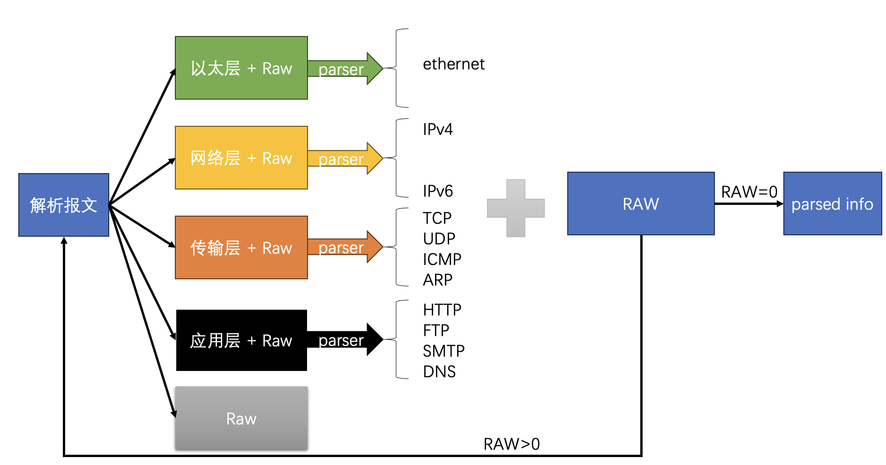

### database.py

利用sqlite来实现数据库的构建，sqlite3是一个python自带的轻量级数据库模块，使用起来比较方便，每次存储关键信息。

**功能**：对解析后的报文信息进行存储。

**模块结构**：

```python
class PacketDatabase:
    def __init__(self, db_file="packets.db"):
        self.db_file = db_file
        self._init_database()
    def _init_database(self):
        """初始化数据库"""
    def insert_packet(self, packet_info):
        """插入数据包信息"""
    def get_recent_packets(self, limit=100):
        """获取最近的数据包"""
    def get_transport_stats(self):
        """获取传输层协议统计 - 只统计已知协议"""
    def get_app_stats(self):
        """获取应用层协议统计 - 只统计已知协议"""
    def clear_database(self):
        """清空数据库"""
```

### web_dashboard.py

使用Flask框架实现。

Flask 是一个微框架，提供了最基本的功能，不强制使用任何特定的工具或库。它的核心是简单而灵活的，允许开发者根据需要添加功能。

**功能**：网络界面的后端实现。

**模块结构**

```python
app = Flask(__name__)
sniffer = None
db = PacketDatabase()

@app.route('/')
def index():
    """主页面"""
@app.route('/api/interfaces')
def get_interfaces():
    """获取可用网络接口"""
@app.route('/api/start_sniffing', methods=['POST'])
def start_sniffing():
    """开始抓包"""
@app.route('/api/stop_sniffing', methods=['POST'])
def stop_sniffing():
    """停止抓包"""
@app.route('/api/packets')
def get_packets():
    """获取数据包列表"""
@app.route('/api/transport_stats')
def get_transport_stats():
    """获取传输层协议统计"""
@app.route('/api/app_stats')
def get_app_stats():
    """获取应用层协议统计"""
@app.route('/api/clear', methods=['POST'])
def clear_data():
    """清空数据"""
```

### 前端

前端接口的实现在`web_dashboard.py`模块里。整体的布局如下。

```
容器 (Container)
├── 头部 (Header) - 标题和描述
├── 控制面板 (Control Panel) - 抓包控制
├── 标签页系统 (Tab System)
    ├── 仪表板 (Dashboard) - 统计图表
    ├── 数据包列表 (Packets) - 数据包表格
    ├── 协议详情 (Protocols) - 详细协议分析
    └── 原始数据 (Raw) - 十六进制数据
```

接下来简单介绍了每个模块的关键代码。

#### 控制面板

**功能**：选择网络接口（自动检测可用接口）、设置BPF过滤条件、控制抓包启停、清空历史数据。

```javascript
<div class="controls">
    <!-- 网络接口选择 -->
    <select id="interfaceSelect">...</select>
    
    <!-- 过滤条件输入 -->
    <input id="filter" placeholder="过滤条件...">
    
    <!-- 控制按钮 -->
    <button class="btn-start">开始抓包</button>
    <button class="btn-stop">停止抓包</button>
    <button class="btn-clear">清空数据</button>
</div>
```

#### **仪表板**

**功能**：实时显示协议分布、流量统计卡片、运行状态监控。

```javascript
// 传输层协议分布图
const transportChart = new Chart(ctx, {
    type: 'doughnut',
    data: { labels: ['TCP', 'UDP', 'ICMP'], datasets: [...] }
});

// 应用层协议分布图  
const appChart = new Chart(ctx, {
    type: 'pie', 
    data: { labels: ['HTTP', 'DNS', 'FTP'], datasets: [...] }
});
```

#### **数据包列表**

**功能**：实时数据包列表、彩色协议标识、点击查看详情。

```javascript
// 数据包行生成
packets.forEach(packet => {
    const row = `
        <td>${时间}</td>
        <td>${源IP:端口}</td>
        <td>${目标IP:端口}</td>
        <td>${协议徽章}</td>
        <td>${长度}</td>
        <td>${概要}</td>
    `;
});
```

#### **协议详情** 

**功能**：完整协议栈分析、各层字段详细展示、智能字段格式化。

```javascript
function showProtocolDetails(packet) {
    // 分层显示协议信息
    if (packet.ethernet) createLayerInfo('数据链路层', packet.ethernet);
    if (packet.network_layer) createLayerInfo('网络层', packet.network_layer);
    if (packet.transport_layer) createLayerInfo('传输层', packet.transport_layer);
    if (packet.application_layer) createLayerInfo('应用层', packet.application_layer);
}
```

## 演示

#### 选择网口和抓取报文

进入前端界面后，在`控制面板`处可以选择网络接口并设置过滤条件，点击右侧即可抓取报文。

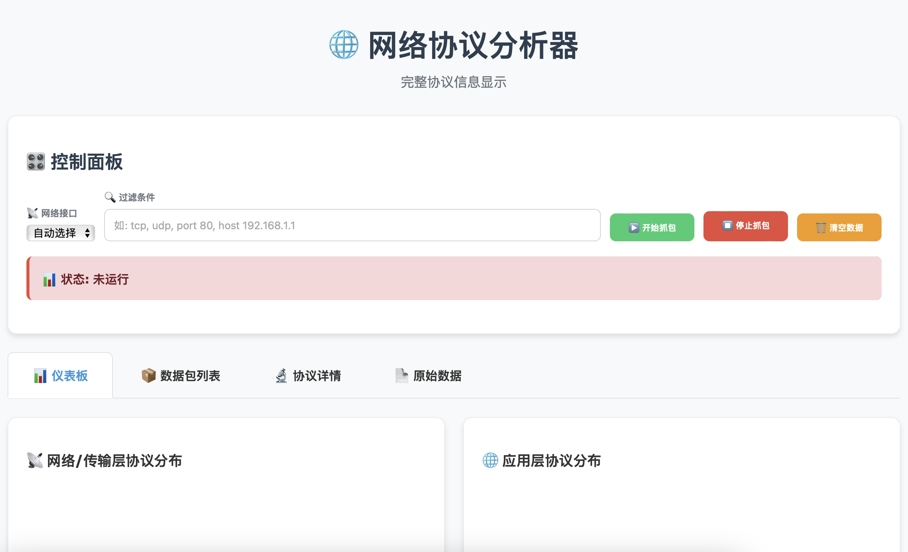

我们选择en0网络接口，并设置过滤条件为udp，开始抓包。

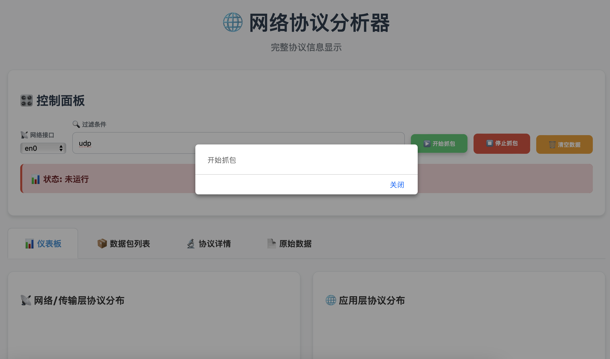

停止抓包。

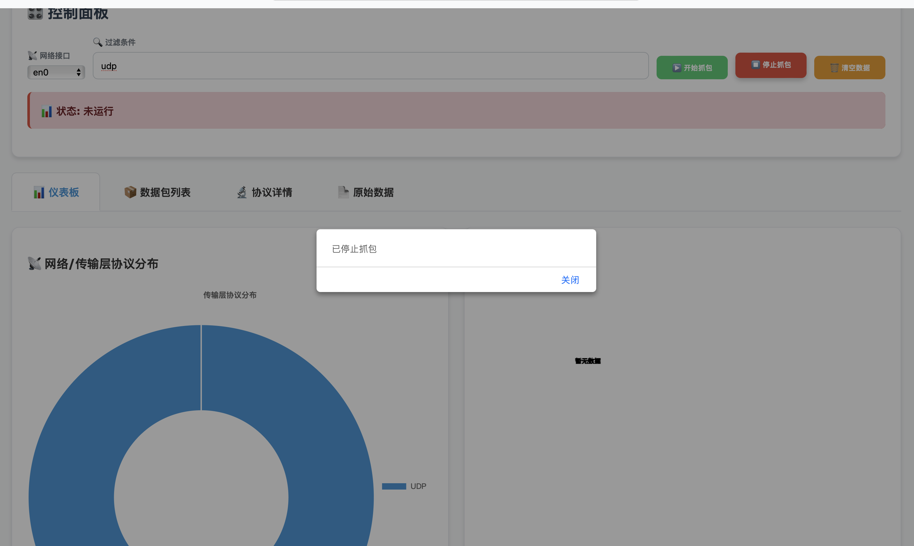

可以看见收集到的全是UDP报文，因为没有设置基于UDP的应用层协议，所有没有应用层。

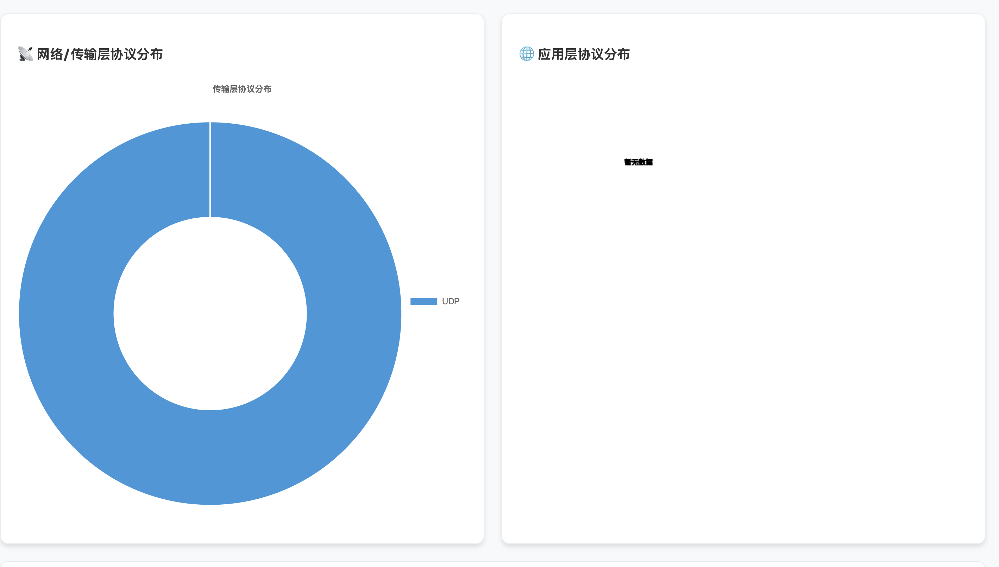

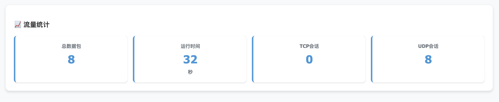

我们这次不设置过滤条件，清空数据后，再次抓取报文。

可以看到在网络/传输层中TCP占据了主要地位。而在应用层中DNS协议占据了主要部分，是由于目前大部分网页访问都是HTTPS协议，，HTTPS是目前互联网的主流，所以导致识别出来的HTTP协议就很少。

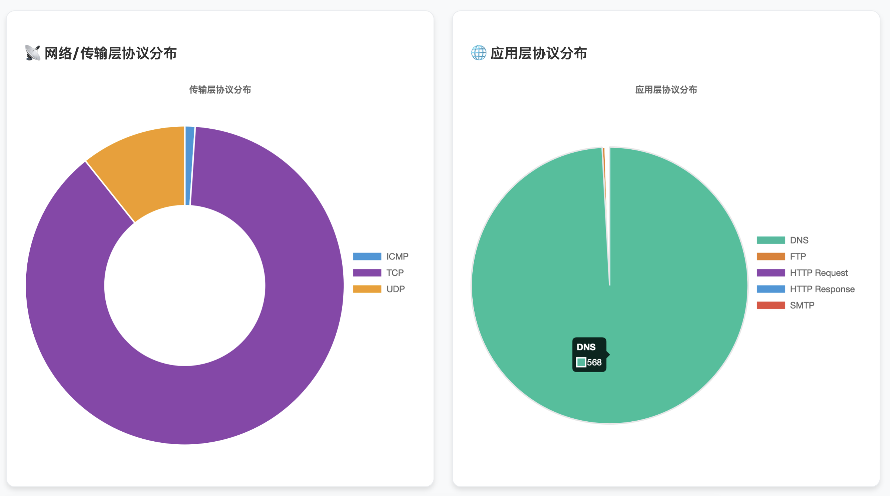

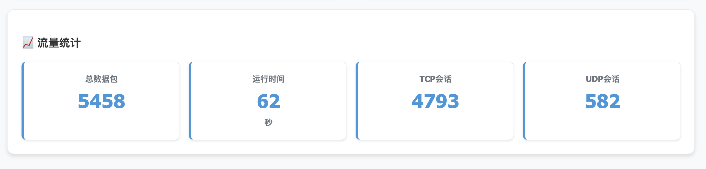

### 报文分析

基于上面的抓取的结果来分析报文。

在`数据包列表`窗口，可以看到最近抓取的100个数据包，里面显示了报文的基本信息。

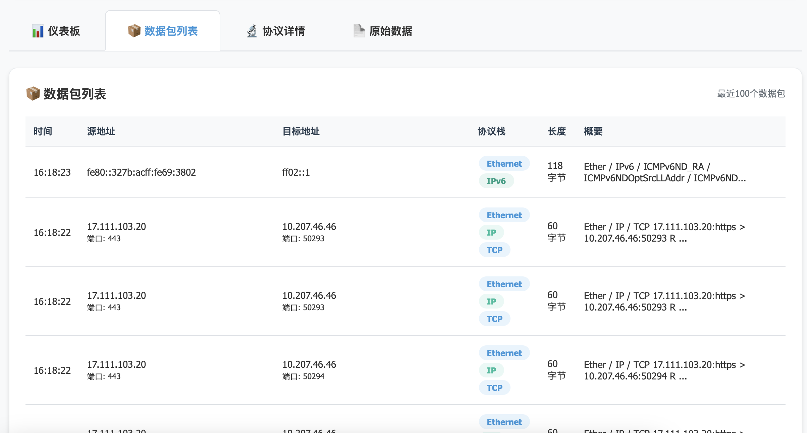

点击选取一个报文，即可以在`协议详情`和`原始数据`窗口观察具体数据。以上图中的第二个报文为例子。

协议详情窗口的上方是基本信息，在下方有不同协议层的具体信息，具体到每一个字段，并做了UI美化。

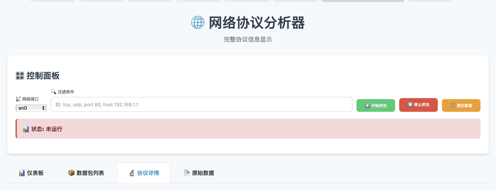


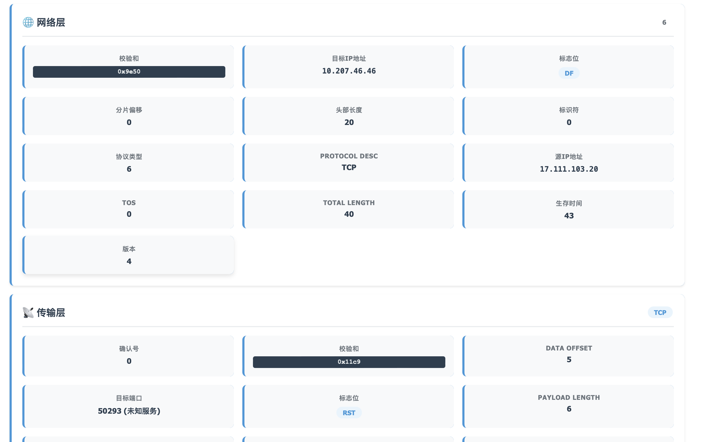

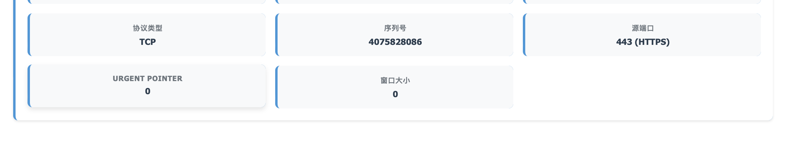

在原始数据窗口可以显示该报文原始信息。可以看到这段保文可能是在已加密或二进制协议中的一小段应用数据，也可能是命令、响应或心跳报文。

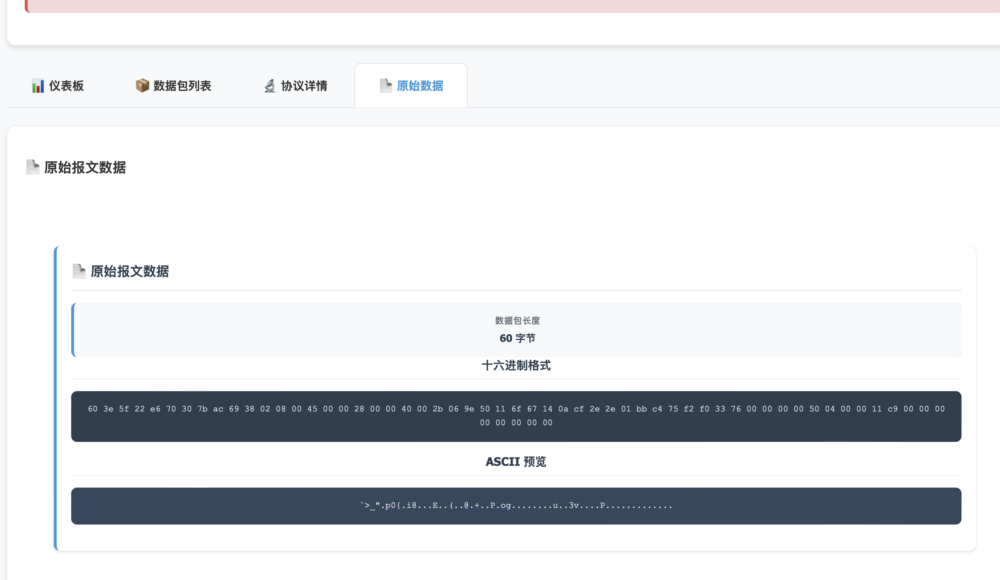

## 总结和不足

EmojiSniffer能够实现嗅探器的基本功能，能够正确地抓取报文，解析报文协议，并提供了好的前端展示界面，能够很好的展现抓取到的报文分布。且EmojiSniffer基于python实现，代码简单，实现容易。

但目前实现的网络协议较少，特别是应用层协议，未来可以继续在这个框架框架上添加更多的常见网络协议，能保证运行效率的同时，更好的检测网络状况。

目前框架中实现的功能比较少，有很多常见的方便供开发者使用的基础操作还并不完善，例如：筛选已抓取的报文、保存/读取报文。

在作业提交之后该项目会开源。 [EmojiSniffer仓库](https://github.com/RamBree/EmojiSniffer)
