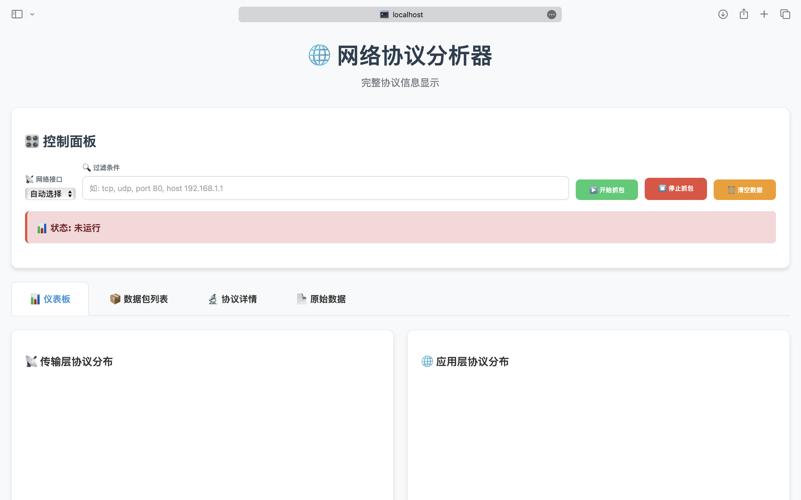

# 网络攻防基础实验一EmojiSniffer

> 完成人：冉文博

EmojiSniffer的实现的**功能**包括

1. 选择主机上的网络端口
2. 抓捕报文并分类。分为两大类：网络/传输层和应用层。网络/传输层的协议包括TCP、UDP、ICMP、ICMPv6、IGMP、ARP。应用层协议包括：DNS、HTTP、FTP、SMTP。
3. 递归解析上述支持协议的协议字段信息。
4. 前端展示。用了很多emoji🧑‍💻，也是该嗅探器的名字来源。

启动过程。访问本机` 5555`端口查看界面。

```
python web_dashboard.py 
数据库表初始化完成
启动Web仪表板...
访问 http://localhost:5555 查看界面
```



## 环境以及项目结构

EmojiSniffer由python编写，`requirements.txt` 如下

```
scapy
flask
psutil
matplotlib
```

**项目结构**

```
EmojiSniffer/
├── sniffer.py
├── packet_parser.py
├── web_dashboard.py
├── database.py
├── requirements.txt
└── templates/
    └── index.html
```

## 实现

介绍每一个模块所实现的功能
